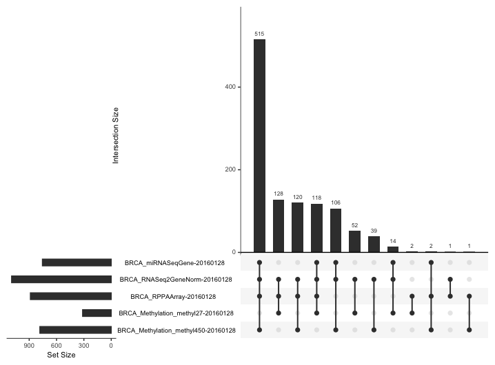

# MasterProject

### Downloading Data
The **Breast invasive carcinoma** database from TCGA was chosen using the code 'BRCA'.
The data was downloaded using the ```curatedTCGAData()``` function.\
The data was filtered to include only primary tumour samples and stored as a MultiAssayExperiment object called ```cancer_data```.\
The ```cancer_data``` object contains data from five experiments, each a SummarizedExperiment object associated with different omics methods:
1. BRCA_miRNASeqGene-20160128:
   - Type: SummarizedExperiment
   - Contains 1046 miRNA features and 499 samples.

2. **BRCA_RNASeq2GeneNorm-20160128:**
   - Type: SummarizedExperiment
   - Contains 20,501 RNA-seq gene features and 782 samples.

3. BRCA_RPPAArray-20160128:
   - Type: SummarizedExperiment
   - Contains 226 protein features from the RPPA assay and 642 samples.

4. BRCA_Methylation_methyl27-20160128:
   - Type: SummarizedExperiment
   - Contains 27,578 features from the 27k methylation array and 272 samples.

5. **BRCA_Methylation_methyl450-20160128:**
   - Type: SummarizedExperiment
   - Contains 485,577 features from the 450k methylation array and 511 samples.
  
The following figure is an UpSet plot showing the intersection of samples in the five experiments.\


```cancer_data``` was exported as an RDS file (data/raw/rnaseqnorm_meth_rppa_mirna_BRCATCGA.rds).\
Datasets 2 and 5 were selected for future model training.

### Train-Test Split
The data was split using a 60:40 proportion. The training and testing sets of patients were stored as a csv file (data/raw/patients_BRCATCGA.csv).

### NMF Optimisation
1. Normalisation\
   The matrix of expression was normalised to allow for more interpretable and comparable results (MSE).
2. Sparsity\
   Matrix not sparce (<14.39% of values == 0)
3. Choosing the Right Solver\
   Coordinate descent (cd) vs Multiplicative update (mu)\
   (all other parameters kept constant)
   
| Method | Reconstruction Error (MSE) | Convergence Speed (seconds) | Stability (variance over 5 runs) |
|--------|-----------------------------|------------------------------|-----------------------------------|
| cd     | 3.468 e-05                 | 49                           | 0.000369                         |
| mu     | 3.602 e-05                 | 33                           | 0.000226                         |

   While the reconstruction error is higher for mu, the convergence speed and increased stability make it the preffered solver. Reconstruction error can later be minimised by adjusting the ```max_iter``` and ```n_components``` parameters of the NMF() function.
   
4. Optimising the Number of Components\
   Elbow method and variance explained. k can also be optimised by looking at scores of downstream DL models.\
   While creating plots for recosntruction error and variance by iteratively increasing ```n_components``` and re-running NMF() is too computationally expensive for the dataset and target number of components (~2000), the MSE for a 2000 component NMF was found to be **6.5448 e-07**.

### Optimising NMF Feature selection
The [first method](NMF/NMF_feature_selection.ipynb) for feature selection simply took the n features with most contribution per row (i.e., per component).\
The [new feature selection method](NMF/NMF_feature_selection_optimisation.ipynb) iterated through the components of the matrix H, selecting n number of top features, and each time dropping those features so that they cannot be selected again.
   


   


  
