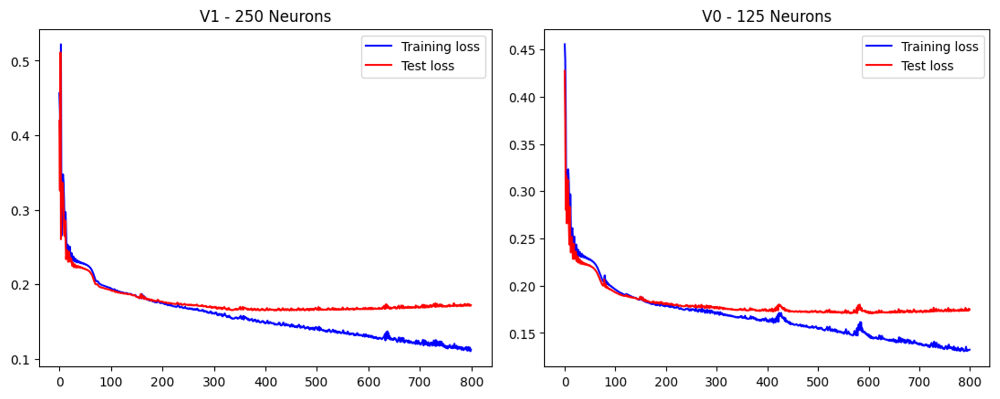
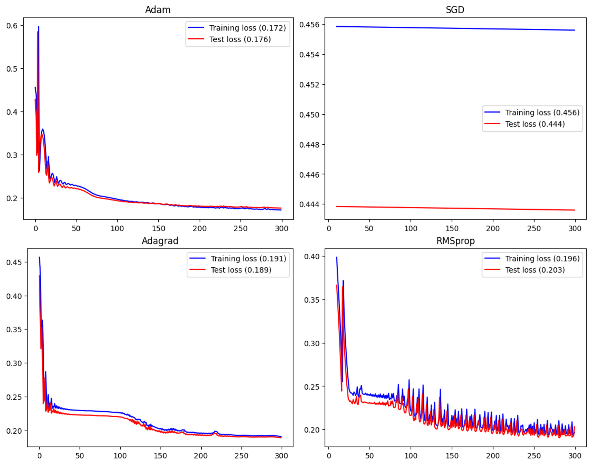

# MasterProject

### Index
1. [Downloading Data](#downloading-data)
2. [NMF Optimisation](#nmf-optimisation)
3. [Feature Selection](#feature-selection)
      - [Methods](#methods)
      - [Results](#results)
4. [Data Integration](#data-integration)
5. [Autoencoder Development](#autoencoder-development)
      - [Hyperparameter Optimisation](#hyperparameter-optimisation)  
  
<hr>

## Downloading Data
The **Breast invasive carcinoma** database from TCGA was chosen using the code 'BRCA'.
The data was downloaded using the ```curatedTCGAData()``` function.\
The data was filtered to include only primary tumour samples and stored as a MultiAssayExperiment object called ```cancer_data```.\
The ```cancer_data``` object contains data from five experiments, each a SummarizedExperiment object associated with different omics methods:
1. BRCA_miRNASeqGene-20160128:
   - Type: SummarizedExperiment
   - Contains 1046 miRNA features and 499 samples.

2. **BRCA_RNASeq2GeneNorm-20160128:**
   - Type: SummarizedExperiment
   - Contains 20,501 RNA-seq gene features and 782 samples.

3. BRCA_RPPAArray-20160128:
   - Type: SummarizedExperiment
   - Contains 226 protein features from the RPPA assay and 642 samples.

4. BRCA_Methylation_methyl27-20160128:
   - Type: SummarizedExperiment
   - Contains 27,578 features from the 27k methylation array and 272 samples.

5. **BRCA_Methylation_methyl450-20160128:**
   - Type: SummarizedExperiment
   - Contains 485,577 features from the 450k methylation array and 511 samples.
  
The following figure is an UpSet plot showing the intersection of samples in the five experiments.\


```cancer_data``` was exported as an RDS file (data/raw/rnaseqnorm_meth_rppa_mirna_BRCATCGA.rds).\
Datasets 2 and 5 were selected for future model training.

#### Train-Test Split
The data was split using a 60:40 proportion. The training and testing sets of patients were stored as a csv file (data/raw/patients_BRCATCGA.csv).

<hr>

## NMF Optimisation
1. Normalisation\
   The matrix of expression was normalised to allow for more interpretable and comparable results (MSE).
2. Choosing the Right Solver\
   Coordinate descent (cd) vs Multiplicative update (mu)\
   (all other parameters kept constant)
   
| Method | Reconstruction Error (MSE) | Convergence Speed (seconds) | Stability (variance over 5 runs) |
|--------|-----------------------------|------------------------------|-----------------------------------|
| cd     | 3.468 e-05                 | 49                           | 0.000369                         |
| mu     | 3.602 e-05                 | 33                           | 0.000226                         |

   While the reconstruction error is higher for mu, the convergence speed and increased stability make it the preffered solver. Reconstruction error can later be minimised by adjusting the ```max_iter``` and ```n_components``` parameters of the NMF() function.
   
3. Optimising the Number of Components\
   Different values of ```n_components``` were tested, and the resulting mean squared error (MSE) was plotted. The resulting elbow plots were analysed to determine the optimal number of components to use. This optimal value balances minimising the MSE while avoiding overfitting.\
   \
   **Selected number of components: 250**

   \
   **Selected number of components: 200**

<hr>

## Feature Selection
### Methods:
**1. Top Features Contributing to NMF components.**\
\
[*Method 1 Script*](Feature_Selection/Method_1.py)\
\
In this method, the top 8 RNA-seq and top 10 DNA Methylation features per component were extracted. Duplicates were removed.
```
For each component: 
   get the top num_top_features features with the highest value
   Append the features to a the top_features list

Sort top_features and remove duplicates
```
\
**2. Top Feature (iterative)**\
\
[*Method 2 Script*](Feature_Selection/Method_2.py)\
\
The feature with the highest contribution was selected and removed. This was repeated until 2000 features were selected.
```
For n in f_per_component:
   Sort the components based on their max. Value
   For each sorted component:
      Append component index to components list
      Select the top feature
      Append the feature index and its value to the selected_features dictionary 
      Drop the current feature
```
\
**3. Laplacian Score**\
\
[*Laplacian Score Script*](Feature_Selection/LS.py)\
\
The Laplacian score is a feature selection method that evaluates the relevance of each feature based on its locality-preserving properties. It emphasizes features that maintain the intrinsic structure of the data.\
To determine the optimal number of neighbors (n_neighbors) for the Laplacian score calculation, a plot of n_neighbors versus the average Laplacian score was analyzed. This helped identify the point at which the score was maximized without overfitting.\
\
**Selected n_neighbors: 10**
\
\
**4. Forward Iterative Laplacian Score Algorithm**\
\
[*FILS Script*](Feature_Selection/FILS.py)\
\
An algorithm that iteratively selects and removes the feature with the highest Laplacian score.\
[*Skipped due to runtime complexity*]
\
\
**5. Sparse PCA**\
\
[*Sparse PCA Script*](Feature_Selection/Sparse_PCA.py)\
\
Sparse PCA is a dimensionality reduction technique that balances data compression with feature sparsity. The first step involved determining the optimal number of components (```n_components```) by analysing its influence on the explained variance ratio. A graph was used to illustrate the relationship between the number of components and the percentage of variance explained.\
\
From the graph, **n_components = 1000** was selected as it explained over 80% of the variance while maintaining computational efficiency. This choice ensures a balance between retaining significant information and optimising runtime.\
After performing Sparse PCA on both datasets, the explained variances were:
   * DNA Methylation: **87.13%**
   * RNA-seq: **88.41%**

### Results:   
1. Number of Features Selected
   | Method               | RNA-seq | DNA Methylation |
   |-----------------------|---------|-----------------|
   | Top Features NMF     | 1502    | 1260            |
   | NMF Iterative        | 2000    | 2000            |
   | Laplacian Score      | 2000    | 2000            |
   | Sparse PCA           | 2032    | 2000            |

2. Commonly Selected Features
   
   | Features Common to: | RNA-seq | DNA Methylation |
   |----------------------|---------|-----------------|
   | 4 sets (all)         | 612     | 431             |
   | 3 sets               | 1018    | 1045            |
   | 2 sets               | 681     | 908             |
   | Single sets only     | 670     | 585             |

   Based on these results, the final set of features selected for training the deep learning model were the features common in 3 or more sets.
   * RNA-seq: **1630 selected features**
   * DNA Methylation: **1476 selected features**
  
<hr>

## Data Integration
[*Data integration script*](Data_Integration.ipynb)\
\
Following feature selection from the RNA-seq and DNA methylation datasets, the original datasets were edited to retain only the chosen features and the samples shared between both datasets. These refined datasets were then optimised and prepared for training the autoencoder.\
The final datasets look as follows:
* RNA-seq: **1630 features, 511 samples**
* DNA Methylation: **1476 features, 511 samples**

<hr>

## Autoencoder Development

The next step was to develop a neiral network-based autoencoder model that will take the selected features for both datasets and further reduce their size by creating a latent space representation of the data. This latent space representation is developed by the deep learning algorithm and its accuracy can be assessed by the model's accuracy in reproducing the original data. The autoencoder was developed using PyTorch.

### Hyperparameter Optimisation

Autoencoder development requires a hyperparameter optimisation step. The hyperparameters adjusted for optimisation include:

1. Number of epochs for training
2. Optimiser and learning rate
3. The number of neurons in the latent space

The model uses an L1 loss function, i.e., the mean absolute error (MAE) for accessing the models reproducing capacity. 

#### Version 0 and 1 - Epochs

Two models (version 0 and 1) were developed with the fallowing hyperparameters to examine the effect that increasing the number of epochs has on the train and test loss as well as overfitting. 

|  | Model V0 | Model V1 |
|----------|----------|----------|
| Neurons in Latent Space   | 125   | 250   |
| Optimizer    | Adam   | Adam   |
| Learning Rate    | 0.001   | 0.001   |
| Final Train Loss    | 0.13   | 0.12   |
| Final Test Loss    | 0.17   | 0.17   |



As expected, the training loss continues to decrease as the number of epochs in the training loop increases, however, test loss flatlines at around 250 epochs. This marks the divergence of the train and test loss trends and the begining of overfitting of the model. To prevent overfitting and to optimise efficiency, **250 epochs** have been selected for subsequent training. 

#### Optimizer Comparison

Model V0 was used to compare four different optimizers - Adam, SGD, RMSprop, and Adagrad. All other hyperparameters were kept constant (lr = 0.001, 800 epochs) apart from SGD which required an increase in both learning rate and number of epochs to converge (lr = 0.01, 10'000 epochs). Below we can see the loss vs epochs graphs and a table to summarise the minimum loss achieved.



|  | Adam | SGD | RMSprop | Adagrad |
|----------|----------|----------|----------|----------|
| Train Loss    | 0.144   | 0.230   | 0.241   | 0.186   |
| Test Loss    | 0.174   | 0.223   | 0.232  |  0.186  |

From these results we can see that despite the slight overfitting towards the end of training, the **Adam** optimizer performs best and most efficiently. As such, the Adam optimizer will be used in the final model.

#### The Number of Neurons in the Latent Space


   


   


  
